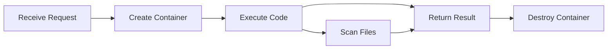
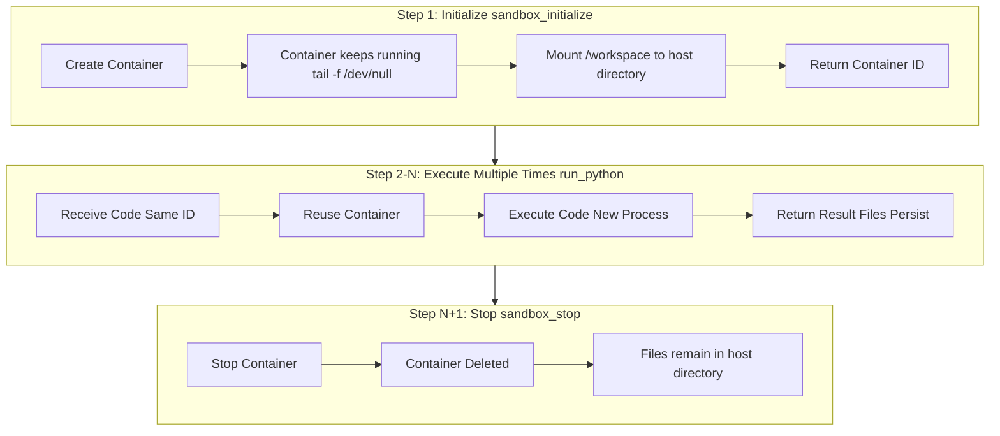
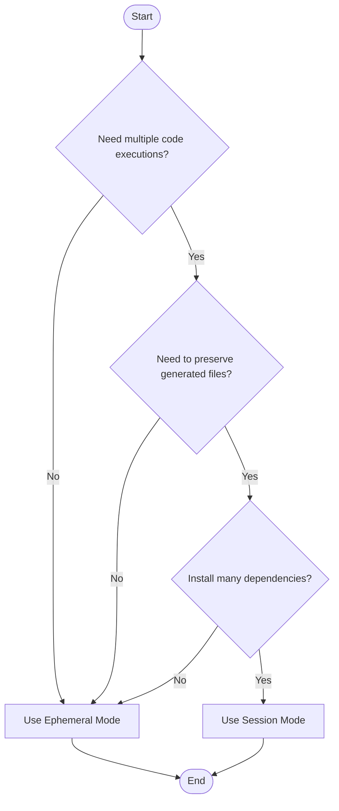

# Execution Modes Design Document

This document details the two execution modes of Python Code Sandbox MCP, clarifies common misconceptions, and guides you on selecting the appropriate mode.

## Table of Contents

1. [Mode Overview](#mode-overview)
2. [Ephemeral Mode](#ephemeral-mode)
3. [Session Mode](#session-mode)
4. [Core Concepts Clarified](#core-concepts-clarified)
5. [Comparison Overview](#comparison-overview)
6. [Usage Recommendations](#usage-recommendations)
7. [Common Misconceptions](#common-misconceptions)

---

## Mode Overview

Python Code Sandbox MCP provides two execution modes:

| Mode | Entry Tool | Use Case |
|-----|---------|---------|
| **Ephemeral Mode** | `run_python_ephemeral` | One-time tasks, automatic cleanup |
| **Session Mode** | `sandbox_initialize` -> `run_python` -> `sandbox_stop` | Multi-step tasks, need to maintain file state |

---

## Ephemeral Mode

### Execution Flow



### Characteristics

- **Lifecycle**: Create -> Execute -> Auto-destroy (one-time)
- **Container State**: Not preserved, deleted immediately after execution
- **File Handling**: Scan `/workspace` during execution, return files to client, then destroy with container
- **Dependency Installation**: Reinstall on every execution

### Code Example

```python
# Client call
result = await session.call_tool("run_python_ephemeral", {
    "code": "import pandas as pd; df = pd.DataFrame({'a': [1,2,3]}); print(df)",
    "dependencies": ["pandas"]
})
```

### Internal Implementation

```python
# server.py simplified logic
container_id = start_sandbox()      # 1. Create container
ensure_dependencies(container_id)    # 2. Install dependencies
stdout, stderr = run_python_code(container_id, code)  # 3. Execute
files = list_files(container_id)     # 4. Collect files
stop_sandbox(container_id)           # 5. Destroy container (finally block)
```

---

## Session Mode

### Execution Flow



### Characteristics

- **Lifecycle**: Manual create -> Multiple executions -> Manual stop
- **Container State**: Container keeps running, reuses same Python environment
- **File Persistence**: `/workspace` mounted to host directory, files accessible after container destruction
- **Dependency Installation**: Install once, reuse in subsequent calls

### Code Example

```python
# Step 1: Initialize
init_result = await session.call_tool("sandbox_initialize", {})
# Returns: "Sandbox initialized. Container ID: abc123..."
container_id = "abc123..."

# Step 2: First execution - install dependencies and create file
result1 = await session.call_tool("run_python", {
    "container_id": container_id,
    "code": "import pandas as pd; df = pd.DataFrame({'a': [1,2,3]}); df.to_csv('data.csv')",
    "dependencies": ["pandas"]
})

# Step 3: Second execution - read previously created file (file still exists!)
result2 = await session.call_tool("run_python", {
    "container_id": container_id,
    "code": "import pandas as pd; df = pd.read_csv('data.csv'); print(df.shape)",
    "dependencies": []  # No need to install again
})

# Step 4: Stop
await session.call_tool("sandbox_stop", {"container_id": container_id})
```

### Internal Implementation

```python
# docker_utils.py - Keep container running
container = client.containers.run(
    image,
    command="tail -f /dev/null",  # Key: keep container running
    detach=True,
    volumes={files_dir: {"bind": "/workspace", "mode": "rw"}}  # Mount host directory
)

# Multiple run_python calls - execute in same container
exec_command(container_id, "python -c '...'")  # New process each time, but same container
```

---

## Core Concepts Clarified

### Important: What "Persistence" Really Means

Session mode's "state persistence" **does NOT include keeping Python variables in memory**.

#### Each `run_python` Call is a New Python Process

```
Call 1: python -c "import pandas as pd; df = ..."  -> Proc 1 starts -> Exec -> Proc 1 exits
Call 2: python -c "print(df.shape)"               -> Proc 2 starts -> NameError: df undefined!
```

#### What Actually Persists

| Type | Persisted? | Explanation |
|-----|---------|------|
| **Installed packages** | Yes | Installed in container filesystem |
| **Created files** | Yes | Persisted via host mount |
| **Python variables** | No | New process each time, destroyed after execution |
| **Memory state** | No | Released when process ends |

#### Correct Way to Share State

```python
# Wrong: Relying on variables in memory
# Call 1
code1 = "import pandas as pd; df = pd.DataFrame({'a': [1,2,3]})"
# Call 2 - will fail!
code2 = "print(df.shape)"  # NameError!

# Correct: Share state through files
# Call 1
code1 = """
import pandas as pd
df = pd.DataFrame({'a': [1,2,3]})
df.to_csv('data.csv', index=False)  # Save to file
"""
# Call 2 - Success!
code2 = """
import pandas as pd
df = pd.read_csv('data.csv')  # Read from file
print(df.shape)
"""
```

---

## Comparison Overview

| Feature | Ephemeral Mode | Session Mode |
|-----|---------|---------|
| **Container Lifecycle** | Create -> Execute -> Immediate destroy | Create -> Multiple executions -> Manual destroy |
| **Container Reuse** | No reuse | Reuse same container |
| **Dependency Installation** | Reinstall every time | Install once |
| **File Persistence** | Return to client then destroy | Mount to host, long-term storage |
| **Python Variables** | Not persisted | Not persisted (new process each time) |
| **Memory State** | Not persisted | Not persisted |
| **Use Cases** | Simple tasks, auto-generated charts | Multi-step data processing, need intermediate files |
| **Resource Usage** | Low (release after use) | Higher (manual management needed) |
| **Timeout Cleanup** | Immediate cleanup | Auto cleanup after 1 hour (background thread) |

---

## Usage Recommendations

### When to Use Ephemeral Mode

```python
# 1. Simple calculations
"Calculate first 10 Fibonacci numbers"

# 2. Generate charts
"Draw a sine wave with matplotlib"

# 3. Data transformation
"Convert this JSON to CSV format"

# 4. API calls
"Call weather API to get today's weather"
```

### When to Use Session Mode

```python
# 1. Multi-step data processing, intermediate files needed
"Step 1: Download and clean data"
"Step 2: Model from cleaned data"
"Step 3: Generate report"

# 2. Install large dependencies, avoid repeated installation
"Install PyTorch (hundreds of MB), then run model multiple times"

# 3. Need to view/download generated files
"Generate an Excel report, I need to download it"

# 4. Interactive development
"First load data to see structure... OK, now analyze... Then plot..."
```

### Decision Flowchart



---

## Common Misconceptions

### Misconception 1: Session Mode Keeps Python Variables

**Wrong Understanding**:
> "In session mode, I define `df = pd.DataFrame(...)` first, then next call can use `df` directly"

**Correct Understanding**:
> Each `run_python` is a new Python process, variables don't persist. Need to pass state through **files**.

### Misconception 2: Session Mode is Faster

**Wrong Understanding**:
> "Session mode avoids container startup overhead, so execution is faster"

**Correct Understanding**:
> While avoiding container startup overhead, the main advantages are **avoiding repeated dependency installation** and **preserving files**. If each execution is independent, ephemeral mode is simpler.

### Misconception 3: Ephemeral Mode Can't Handle Files

**Wrong Understanding**:
> "Files created in ephemeral mode are lost, so can't use files"

**Correct Understanding**:
> Ephemeral mode **scans and returns files** before destroying container. Files can be returned to client through response (as long as not too large).

### Misconception 4: Session Mode = Jupyter Notebook

**Wrong Understanding**:
> "Session mode is like Jupyter, can execute in cells, variables are kept"

**Correct Understanding**:
> Session mode is **NOT** a Jupyter Kernel. It's just a long-running Docker container, each `run_python` is an independent Python process execution. Key difference from Jupyter is **no kernel keeping variable state**.

---

## Technical Implementation Details

### Why Python Variables Can't Persist?

```python
# docker_utils.py - run_python_code implementation
def run_python_code(container_id: str, code: str) -> Tuple[str, str]:
    # Base64 encode code
    b64_code = base64.b64encode(code.encode("utf-8")).decode("utf-8")
    
    # Execute via docker exec
    # Equivalent to running in container: python -c "exec(decoded_code)"
    cmd = f"python -c \"import base64; exec(base64.b64decode('{b64_code}').decode('utf-8'))\""
    
    exit_code, stdout, stderr = exec_command(container_id, cmd)
    return stdout, stderr
```

Key points:
- Use `docker exec` to execute commands in running container
- Each `python -c "..."` starts a new Python process
- After process ends, variables in memory are all released

### File Persistence Implementation

```python
# docker_utils.py - start_sandbox implementation
def start_sandbox(image: str = "python:3.11-slim") -> str:
    files_dir = get_files_dir()  # Host directory
    
    container = client.containers.run(
        image,
        command="tail -f /dev/null",  # Keep container running
        volumes={
            files_dir: {"bind": "/workspace", "mode": "rw"}  # Key: mount host directory
        },
        ...
    )
    return container.id
```

Key points:
- Use Docker **Bind Mount** to mount host directory to container's `/workspace`
- Files written to `/workspace` in container are actually saved on host
- After container destruction, files remain in host directory

---

## Summary

| Key Point | Explanation |
|-----|------|
| **Ephemeral Mode** | "Use and go", suitable for simple tasks, automatic cleanup |
| **Session Mode** | "Workbench", suitable for multi-step tasks, manual management needed |
| **Variable Persistence** | Neither mode can keep Python variables |
| **File Persistence** | Session mode via mount; Ephemeral mode via return |
| **Dependency Reuse** | Session mode only needs to install once |

Choose the appropriate mode and understand its limitations correctly to better use Python Code Sandbox MCP.

