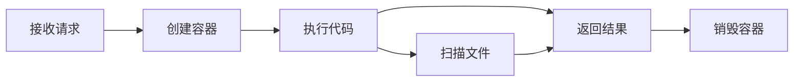
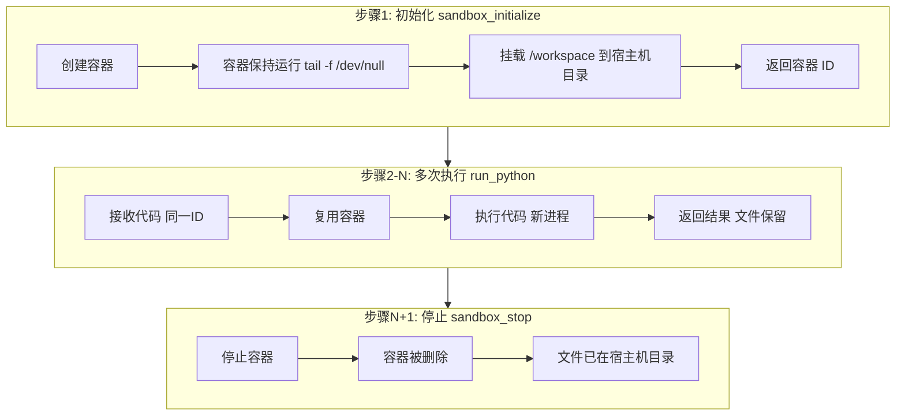
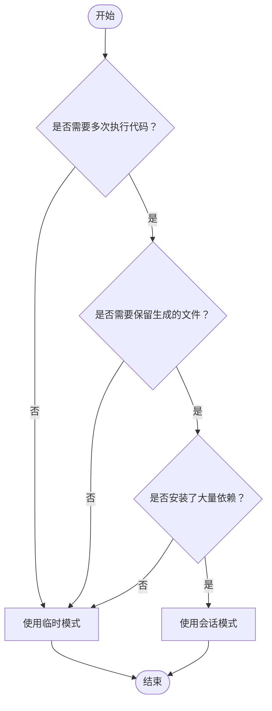

# 执行模式设计文档

本文档详细说明 Python Code Sandbox MCP 的两种执行模式，澄清常见的误解，并指导如何选择合适的模式。

## 目录

1. [模式概览](#模式概览)
2. [临时模式 (Ephemeral Mode)](#临时模式-ephemeral-mode)
3. [会话模式 (Session Mode)](#会话模式-session-mode)
4. [核心概念澄清](#核心概念澄清)
5. [对比总览](#对比总览)
6. [使用建议](#使用建议)
7. [常见误区](#常见误区)

---

## 模式概览

Python Code Sandbox MCP 提供两种执行模式：

| 模式 | 入口工具 | 适用场景 |
|-----|---------|---------|
| **临时模式** | `run_python_ephemeral` | 一次性任务，自动清理 |
| **会话模式** | `sandbox_initialize` -> `run_python` -> `sandbox_stop` | 多步骤任务，需要保持文件状态 |

---

## 临时模式 (Ephemeral Mode)

### 执行流程



### 特点

- **生命周期**: 创建 -> 执行 -> 自动销毁（一次性）
- **容器状态**: 不保留，执行完立即删除
- **文件处理**: 执行期间扫描 `/workspace`，将文件返回给客户端，然后随容器一起销毁
- **依赖安装**: 每次执行都重新安装

### 代码示例

```python
# 客户端调用
result = await session.call_tool("run_python_ephemeral", {
    "code": "import pandas as pd; df = pd.DataFrame({'a': [1,2,3]}); print(df)",
    "dependencies": ["pandas"]
})
```

### 内部实现

```python
# server.py 简化逻辑
container_id = start_sandbox()      # 1. 创建容器
ensure_dependencies(container_id)    # 2. 安装依赖
stdout, stderr = run_python_code(container_id, code)  # 3. 执行
files = list_files(container_id)     # 4. 收集文件
stop_sandbox(container_id)           # 5. 销毁容器（finally 块）
```

---

## 会话模式 (Session Mode)

### 执行流程



### 特点

- **生命周期**: 手动创建 -> 多次执行 -> 手动停止
- **容器状态**: 容器保持运行，复用同一个 Python 环境
- **文件持久化**: `/workspace` 挂载到宿主机目录，文件在容器销毁后仍可访问
- **依赖安装**: 只需安装一次，后续调用复用

### 代码示例

```python
# 步骤 1: 初始化
init_result = await session.call_tool("sandbox_initialize", {})
# 返回: "Sandbox initialized. Container ID: abc123..."
container_id = "abc123..."

# 步骤 2: 第一次执行 - 安装依赖并创建文件
result1 = await session.call_tool("run_python", {
    "container_id": container_id,
    "code": "import pandas as pd; df = pd.DataFrame({'a': [1,2,3]}); df.to_csv('data.csv')",
    "dependencies": ["pandas"]
})

# 步骤 3: 第二次执行 - 读取之前创建的文件（文件仍存在！）
result2 = await session.call_tool("run_python", {
    "container_id": container_id,
    "code": "import pandas as pd; df = pd.read_csv('data.csv'); print(df.shape)",
    "dependencies": []  # 不需要再安装
})

# 步骤 4: 停止
await session.call_tool("sandbox_stop", {"container_id": container_id})
```

### 内部实现

```python
# docker_utils.py - 容器保持运行
container = client.containers.run(
    image,
    command="tail -f /dev/null",  # 关键：让容器持续运行
    detach=True,
    volumes={files_dir: {"bind": "/workspace", "mode": "rw"}}  # 挂载宿主机目录
)

# 多次调用 run_python - 在同一个容器中执行
exec_command(container_id, "python -c '...'")  # 每次新进程，但容器相同
```

---

## 核心概念澄清

### 重要：什么是真正的"持久化"

会话模式的"状态保持"**不包括 Python 变量在内存中的保持**。

#### 每次 `run_python` 调用都是新的 Python 进程

```
调用 1: python -c "import pandas as pd; df = ..."  -> 进程 1 启动 -> 执行 -> 进程 1 退出
调用 2: python -c "print(df.shape)"               -> 进程 2 启动 -> NameError: df 未定义!
```

#### 真正保持的是什么

| 类型 | 是否保持 | 说明 |
|-----|---------|------|
| **已安装的包** | 是 | 安装在容器文件系统中 |
| **创建的文件** | 是 | 通过宿主机挂载持久化 |
| **Python 变量** | 否 | 每次新进程，执行完即销毁 |
| **内存状态** | 否 | 进程结束即释放 |

#### 正确的状态共享方式

```python
# 错误：依赖变量在内存中保持
# 调用 1
code1 = "import pandas as pd; df = pd.DataFrame({'a': [1,2,3]})"
# 调用 2 - 会失败！
code2 = "print(df.shape)"  # NameError!

# 正确：通过文件共享状态
# 调用 1
code1 = """
import pandas as pd
df = pd.DataFrame({'a': [1,2,3]})
df.to_csv('data.csv', index=False)  # 保存到文件
"""
# 调用 2 - 成功！
code2 = """
import pandas as pd
df = pd.read_csv('data.csv')  # 从文件读取
print(df.shape)
"""
```

---

## 对比总览

| 特性 | 临时模式 | 会话模式 |
|-----|---------|---------|
| **容器生命周期** | 创建 -> 执行 -> 立即销毁 | 创建 -> 多次执行 -> 手动销毁 |
| **容器复用** | 不复用 | 复用同一个容器 |
| **依赖安装** | 每次重新安装 | 只需安装一次 |
| **文件持久化** | 返回给客户端后销毁 | 挂载到宿主机，长期保存 |
| **Python 变量** | 不保持 | 不保持（每次新进程） |
| **内存状态** | 不保持 | 不保持 |
| **适用场景** | 简单任务、自动生成图表 | 多步骤数据处理、需保留中间文件 |
| **资源占用** | 低（用完即释放） | 较高（需手动管理） |
| **超时清理** | 立即清理 | 1小时后自动清理（后台线程） |

---

## 使用建议

### 何时使用临时模式

```python
# 1. 简单计算
"计算斐波那契数列前10项"

# 2. 生成图表
"用 matplotlib 画一个正弦波图"

# 3. 数据转换
"将这个 JSON 转换为 CSV 格式"

# 4. API 调用
"调用天气 API 获取今天的天气"
```

### 何时使用会话模式

```python
# 1. 多步骤数据处理，中间文件需要保留
"步骤1: 下载数据并清洗保存"
"步骤2: 从清洗后的数据进行建模"
"步骤3: 生成报告"

# 2. 安装大量依赖，避免重复安装
"安装 PyTorch（几百MB），然后多次运行模型"

# 3. 需要查看/下载生成的文件
"生成一个 Excel 报告，我需要下载它"

# 4. 交互式开发
"先加载数据看看结构... 好，现在分析一下... 再画个图..."
```

### 决策流程图



---

## 常见误区

### 误区 1：会话模式能保持 Python 变量

**错误理解**：
> "会话模式下，我先定义 `df = pd.DataFrame(...)`，下一次调用可以直接用 `df`"

**正确理解**：
> 每次 `run_python` 都是新的 Python 进程，变量不会保留。需要通过**文件**来传递状态。

### 误区 2：会话模式能提高执行速度

**错误理解**：
> "会话模式避免了容器启动开销，所以执行更快"

**正确理解**：
> 虽然避免了容器启动开销，但主要优势是**避免重复安装依赖**和**保留文件**。如果每次执行都是独立任务，临时模式更简单。

### 误区 3：临时模式不能处理文件

**错误理解**：
> "临时模式下创建的文件会丢失，所以不能用文件"

**正确理解**：
> 临时模式会在销毁容器前**扫描并返回文件**。只要不是太大，文件可以通过响应返回给客户端。

### 误区 4：会话模式 = Jupyter Notebook

**错误理解**：
> "会话模式像 Jupyter 一样，可以分单元执行，变量会保持"

**正确理解**：
> 会话模式**不是** Jupyter Kernel。它只是一个长期运行的 Docker 容器，每次 `run_python` 都是独立的 Python 进程执行。与 Jupyter 的关键区别是**没有内核保持变量状态**。

---

## 技术实现细节

### 为什么 Python 变量不能保持？

```python
# docker_utils.py - run_python_code 的实现
def run_python_code(container_id: str, code: str) -> Tuple[str, str]:
    # 将代码 Base64 编码
    b64_code = base64.b64encode(code.encode("utf-8")).decode("utf-8")
    
    # 通过 docker exec 执行
    # 这相当于在容器内运行: python -c "exec(解码后的代码)"
    cmd = f"python -c \"import base64; exec(base64.b64decode('{b64_code}').decode('utf-8'))\""
    
    exit_code, stdout, stderr = exec_command(container_id, cmd)
    return stdout, stderr
```

关键点：
- 使用 `docker exec` 在运行中的容器内执行命令
- 每次执行 `python -c "..."` 都启动一个新的 Python 进程
- 进程结束后，内存中的变量全部释放

### 文件持久化的实现

```python
# docker_utils.py - start_sandbox 的实现
def start_sandbox(image: str = "python:3.11-slim") -> str:
    files_dir = get_files_dir()  # 宿主机目录
    
    container = client.containers.run(
        image,
        command="tail -f /dev/null",  # 保持容器运行
        volumes={
            files_dir: {"bind": "/workspace", "mode": "rw"}  # 关键：宿主机目录挂载
        },
        ...
    )
    return container.id
```

关键点：
- 使用 Docker **Bind Mount** 将宿主机目录挂载到容器的 `/workspace`
- 容器内写入 `/workspace` 的文件实际保存在宿主机
- 容器销毁后，文件仍在宿主机目录中

---

## 总结

| 要点 | 说明 |
|-----|------|
| **临时模式** | "即用即走"，适合简单任务，自动清理 |
| **会话模式** | "工作台"，适合多步骤任务，需手动管理 |
| **变量保持** | 两种模式都不能保持 Python 变量 |
| **文件保持** | 会话模式通过挂载实现；临时模式通过返回实现 |
| **依赖复用** | 会话模式只需安装一次 |

选择合适的模式，正确理解其限制，才能更好地使用 Python Code Sandbox MCP。

